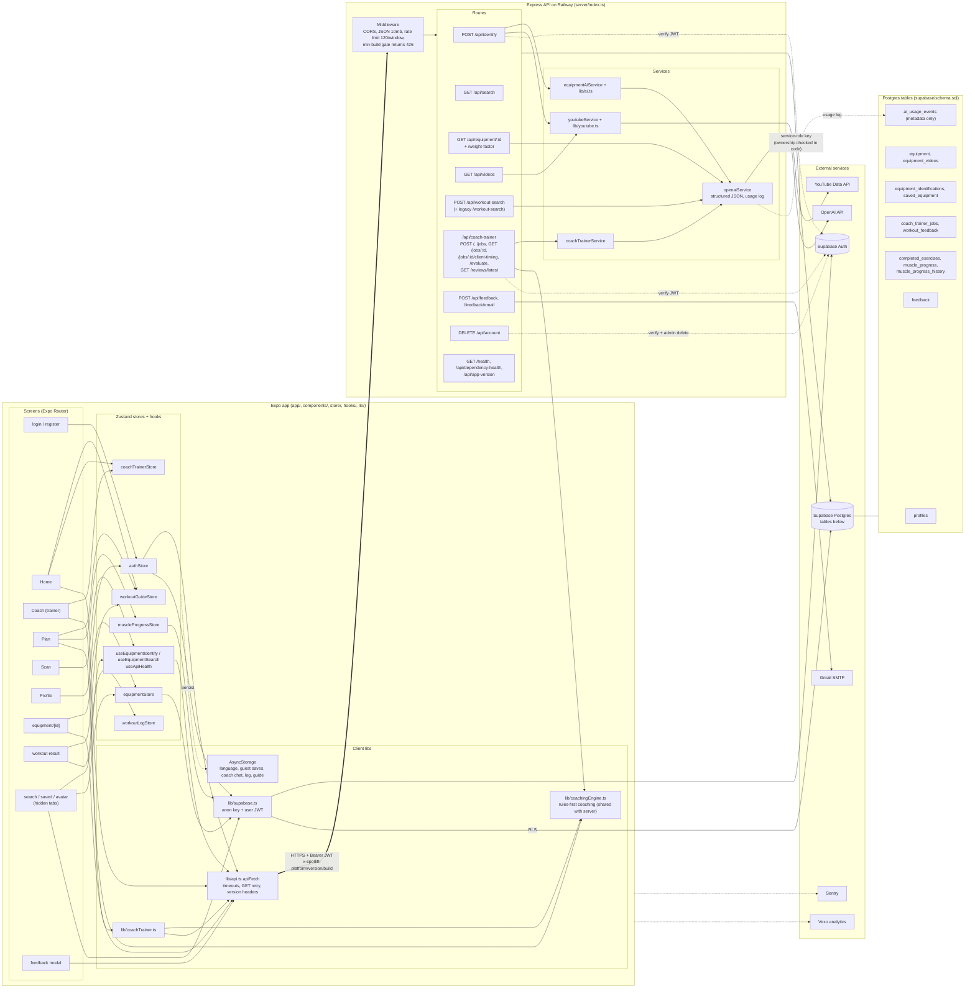

# SpotLift architecture

How the app, backend, database and third-party services connect. Derived from the code (`app/`, `store/`, `hooks/`, `lib/`, `server/`, `supabase/schema.sql`). Paste the Mermaid block into any Mermaid renderer, GitHub, Notion, or an artifact.

> **2026-09-21 update:** written before the main/origin-main reconciliation. Coach and equipment identification now run on **Claude** (`ANTHROPIC_API_KEY`, `claudeService.ts`, `lib/anthropic.ts`), not OpenAI — the diagram and table below still say OpenAI for those two paths. `POST /api/coach-trainer/evaluate` and `/reviews/latest` no longer exist; `lib/coachingEngine.ts` is unreferenced dead code. `POST /api/coach-trainer/jobs` now requires sign-in and an idempotency key. Workout search still uses OpenAI, and now has a Supabase cache (see `docs/coach-rules-router.md` and `workoutGuideCache.ts`). Treat the diagram as the client-side / data-model picture; verify anything AI-provider-specific against the code before relying on it.

## Who calls which API

| Endpoint | Called by (client) | Server verifies user? | Touches |
|---|---|---|---|
| `POST /api/identify` | `useEquipmentIdentify` (Scan tab) | Yes (`auth.getUser`) | OpenAI vision, YouTube, `equipment`, `equipment_identifications`, `equipment_videos` |
| `GET /api/search` | `useEquipmentSearch` (search screen) | No | `equipment` |
| `GET /api/equipment/:id` (+`/weight-factor`) | `equipment/[id]` | No | `equipment`, `equipment_videos`, OpenAI |
| `GET /api/videos` | (no client caller found) | No | `equipment_videos`, YouTube |
| `POST /api/workout-search` | Home tab | No | OpenAI |
| `POST /api/coach-trainer` and `/jobs` | Coach tab via `lib/coachTrainer.ts` | Yes | OpenAI, rules engine, `coach_trainer_jobs` |
| `GET /api/coach-trainer/jobs/:id` | Coach tab (polling) | Yes | `coach_trainer_jobs` |
| `POST /api/coach-trainer/jobs/:id/client-timing` | `lib/coachTrainer.ts` | Yes | `coach_trainer_jobs` |
| `POST /api/coach-trainer/evaluate` | workout feedback modal | Yes | OpenAI, `workout_feedback` |
| `GET /api/coach-trainer/reviews/latest` | Plan/Coach | Yes | `workout_feedback` |
| `POST /api/feedback`, `/feedback/email` | feedback modal, `FeedbackContext` | No | `feedback`, Gmail |
| `DELETE /api/account` | `authStore` (delete account) | Yes | Supabase admin delete, `profiles` |
| `GET /api/app-version` | `ForceUpdateGate` | No | env-based version policy |
| `GET /health`, `/api/dependency-health` | monitoring / `ServiceHealthMonitor` | No | Supabase `equipment` probe |

## Data the client reads/writes directly in Supabase (RLS)

`profiles` (authStore, LanguageToggle), `saved_equipment` (equipmentStore, saved screen), `equipment_identifications` (search screen), `muscle_progress` + `completed_exercises` + RPC (muscleProgressStore), `feedback` (FeedbackContext), plus all `supabase.auth.*` sign-in / sign-up / session calls.

## Local-only data (AsyncStorage)

Language, guest use count and guest saves, Coach chat state, workout log, workout guide, avatar style.

## Environment variables by owner

- **Server only (Railway):** `SUPABASE_SERVICE_ROLE_KEY`, `OPENAI_API_KEY`, `YOUTUBE_API_KEY`, `GMAIL_USER`, `GMAIL_APP_PASSWORD`, OpenAI model and coach-timeout settings, version-policy vars.
- **Public in the app (`EXPO_PUBLIC_*`):** `API_BASE_URL`, `SUPABASE_URL`, `SUPABASE_ANON_KEY`, `SENTRY_DSN`, `VEXO_API_KEY`.

## What creates the API vs what uses it

- **Creates:** `server/index.ts` mounts routers from `server/routes/*`, which call `server/services/*` and shared `lib/ai.ts`, `lib/youtube.ts`, `lib/coachingEngine.ts`. Built with `tsc -p server/tsconfig.json` to `dist-server/`, run by Railway.
- **Uses:** every client call goes through `lib/api.ts` `apiFetch`, except direct Supabase calls in the stores and screens.

## Things worth checking

- `workout-search`, `equipment/:id`, `search`, `videos` and `feedback` routes show no server-side user verification, only the per-IP rate limit. `workout-search` and `equipment/:id/weight-factor` spend OpenAI budget. Hypothesis: confirm intent.
- `GET /api/videos` has no client caller.
