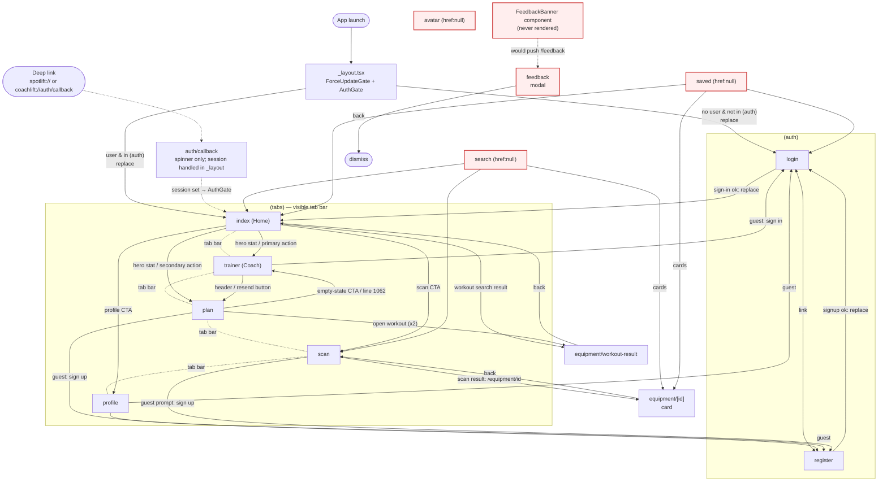

# SpotLift screen flow

Derived from `app/` (Expo Router) plus every `router.push/replace/back` call. Solid arrows = real navigation calls. Dashed = implicit (system/deep link/tab bar). Red nodes = routes that exist but nothing navigates to.

## Oddities

1. **`search`, `saved`, `avatar` are orphaned.** They are hidden tabs (`href: null`) and no `router.push`, `<Link>` or `href` anywhere points to `/search`, `/saved` or `/avatar`. Users cannot reach them. They only navigate outward (to scan, home, login, `equipment/[id]`).
2. **`feedback` modal is unreachable.** Its only caller is `components/UI/FeedbackBanner.tsx`, and nothing renders `FeedbackBanner`. So `equipment/[id]` is only reachable via scan or the orphaned search/saved screens (`EquipmentCard`).
3. **`auth/callback` is a spinner.** The deep link is processed by `handleAuthRedirectUrl` in `_layout.tsx`; the screen never navigates itself. `AuthGate` only redirects if the user is currently in `(auth)`. If the app is opened via the link while on `auth/callback`, a signed-in user is not moved off that screen.
4. **`equipment/workout-result` is not declared in the root `Stack`** (only `equipment/[id]` and `feedback` are). It still works through file routing, with default options.
5. **`router.push("/(tabs)")` in `saved`/`search`** pushes instead of switching tabs, which can stack duplicates of the tabs group.
6. **Guests are forced to login.** `AuthGate` redirects every unauthenticated user to login, so the "guest" sign-up/login prompts in `scan`, `profile`, `plan`, `trainer` are effectively only reachable if a session can be null inside tabs (e.g. after sign-out before the redirect fires).
